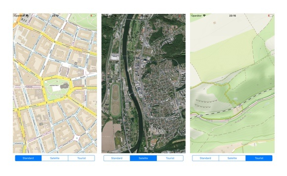

# MapyKit - Native Mapy.cz Swift SDK

MapyKit is native [Mapy.cz](https://mapy.cz) SDK written in Swift. MapyKit uses native `MKMapView` under the hood, so it's compatible with all your current map code. Out of the box.

This project is currently in early development stage, framework APIs may change over time.

<p align="center">
    
</p>

## Installation

Only manual installation from source is supported at the moment. Support for [Carthage](https://github.com/Carthage/Carthage) and [CocoaPods](https://cocoapods.org) comming soon.

## Usage

Once you have downloaded project source, all you have to do is to insert the map view into view hierarchy. The Mapy.cz maps are rendered using `MapyView`, subclass of `MKMapView`:

```swift
let mapView = MapyView()

view.addSubview(mapView)
mapView.setExtendedMapType(mapType: .touristic)
```

Since the view is subclass of `MKMapView`, you can use all API provided by standard map view (e.g. set `delegate` or use map annotations).

### Map types

MapyKit supports multiple map types. The default map type is `ExtendedMapType.standard`. You can change map type manually using `setExtendedMapType(mapType:)` method:

```swift
mapView.setExtendedMapType(mapType: .touristic)
```

Supported map types are listed below.

| Type            | Description | Preview | Number of layers |
|-----------------|-------------|---------|------------------|
| `.standard`     | Standard map view (default) | [preview](https://mapy.cz/zakladni) | 1 |
| `.touristic`    | Standard map with highlighted hiking trails | [preview](https://mapy.cz/turisticka) | 1 |
| `.winter`       | Map of winter resorts | [preview](https://mapy.cz/zimni) | 1 |
| `.satelite`     | Satelite map (without labels) | [preview](https://mapy.cz/letecka) | 1 |
| `.hybrid`       | Satelite map (with labels) | [preview](https://mapy.cz/letecka) | 2 |
| `.hybridNative` | Satelite map (with `MapKit` native labels) | N/A | 1 |
| `.geography`    | Geography map | [preview](https://mapy.cz/zemepisna) | 1 |
| `.historical`   | Historical map from 19th century | [preview](https://mapy.cz/19stoleti) | 1 |
| `.textMap`      | Text-only map | [preview](https://mapy.cz/textova) | 2 |
| `.in100Years`   | Czech Republic in 100 years | [preview](https://mapy.cz/ceskoza100) | 2 |

> Note that maps with multiple layers may download significant amount of data. Thus, map rendering takes more time and may waste user's mobile data plan. Whenever you can, use map types with single layer. If you need to display satelite map with street labels, use `.hybridNative` instead of `.hybrid`.

## Example

See working example of MapyKit with customizable map type in [Example](Example) directory.

## License

This repository is licensed under [MIT](LICENSE).
